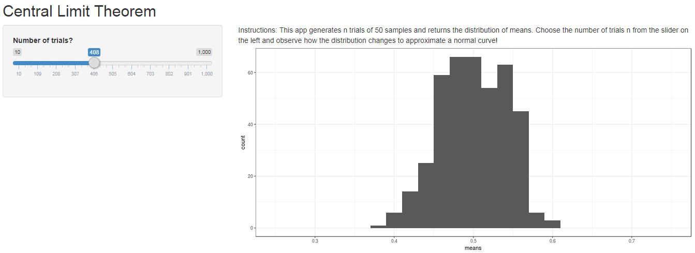

```{r setup, include=FALSE}
knitr::opts_chunk$set(echo = FALSE)
```

## Introduction

This app is a visualisation of the Central Limit Theorem. It will generate n trials of 50 random uniformly distributed numbers and collate the means. Then, it will plot the distribution of means onto a histogram.

## ui.R

```{r, eval=FALSE, echo=TRUE}
library(shiny)

# Define UI for application that draws a histogram
shinyUI(fluidPage(
  
  # Application title
  titlePanel("Central Limit Theorem"),
  
  sidebarLayout(
    sidebarPanel(
      # Sidebar with a slider input for number of trials
      sliderInput("trials", "Number of trials?",
                   min = 10, max = 1000, value = 5)
    ),
    
    mainPanel(
      paste("Instructions: This app generates n trials of 50 samples",
            "and returns the distribution of means. Choose the number",
            "of trials n from the slider on the left and observe how",
            "the distribution changes to approximate a normal curve!"),
      plotOutput("chart")
    )
  )
))

```


## server.R

```{r, eval=FALSE, echo=TRUE}
library(shiny)

# Define server logic required to plot central limit theorem
shinyServer(function(input, output) {
  
  output$chart <- renderPlot({
    numTrials <- input$trials
    numSample <- 50
    means <- c()
    
    # Create list of means
    set.seed(10)
    for(idx in 1:numTrials){
      trial <- runif(numSample)
      means <- c(means, mean(trial))
    }
    
    # Plot histogram
    ggplot2::ggplot(data = data.frame(means), ggplot2::aes(x = means)) + 
      ggplot2::geom_histogram(binwidth = 0.02) +
      ggplot2::theme_bw() +
      ggplot2::lims(x = c(0.25, 0.75))
  })
})

```

## Sample

```{r}

```

